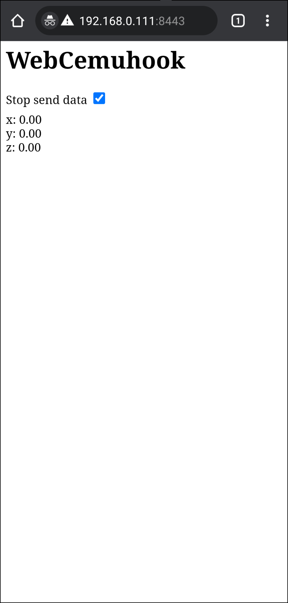
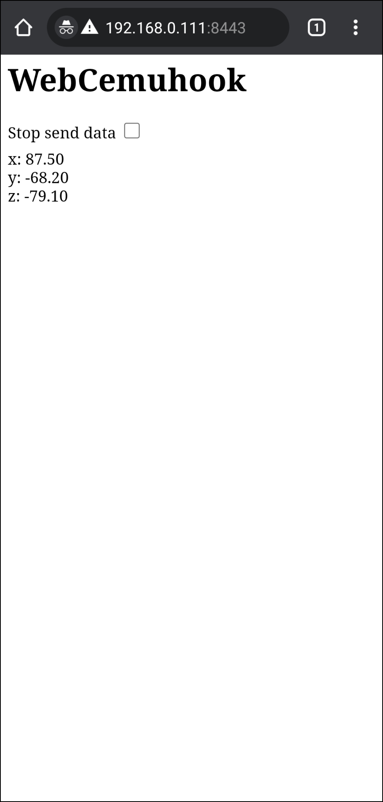

# WebCemuhook

Allow you to use your phone's gyroscope for cemuhook

## Development

```sh
# Generate https certs
openssl req -nodes -new -x509 -days 3650 -keyout tls/server.key -out tls/server.crt

# Run
go run .

# Build (also includes tls and templates folders into executable file)
go build

```
## Screenshots
<h3>Phone screen</h3>
<p align="center">
  
   
</p>

### Demonstration


## Credits

- Thanks to [Ryujinx](https://github.com/Ryujinx/Ryujinx)
- Thanks to [FrogTheFrog](https://github.com/FrogTheFrog/steam-gyro-for-cemuhook)
- Thanks to [hjmmc](https://github.com/hjmmc/WebGyroForCemuhook)
